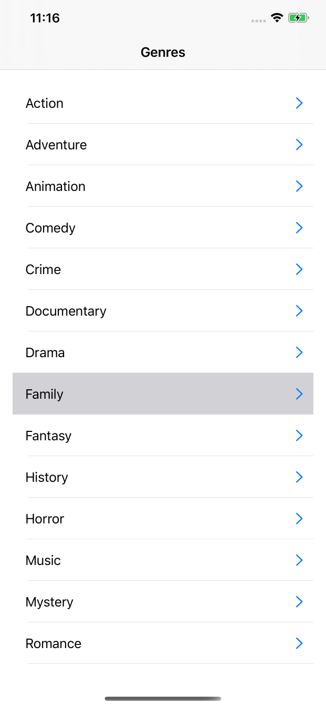
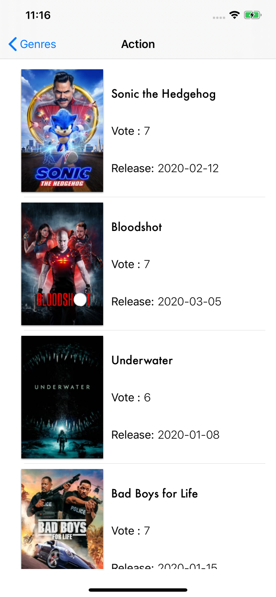
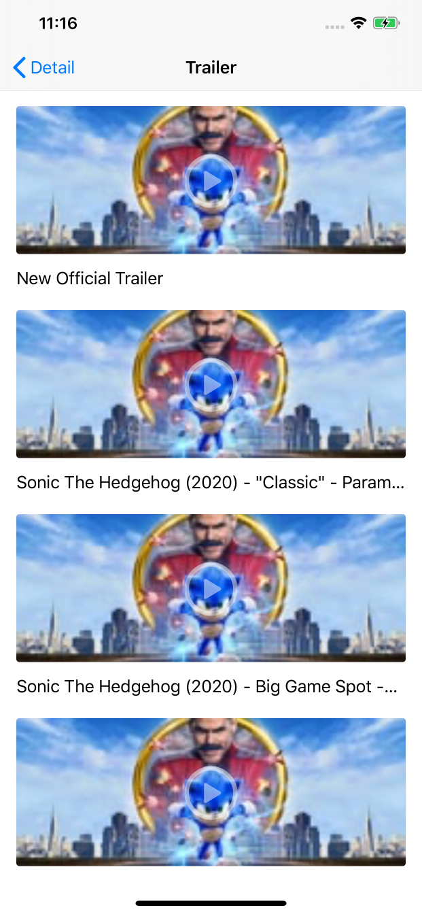
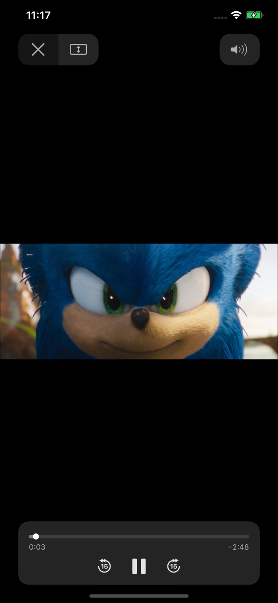
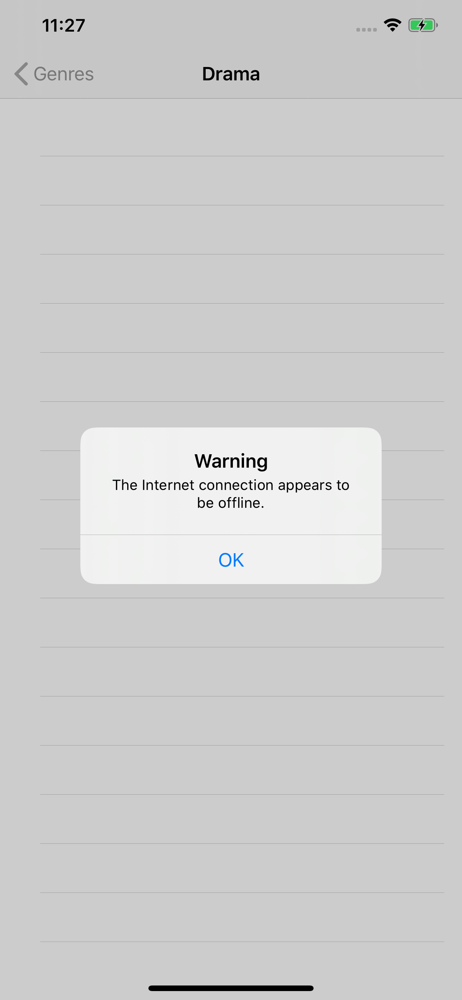
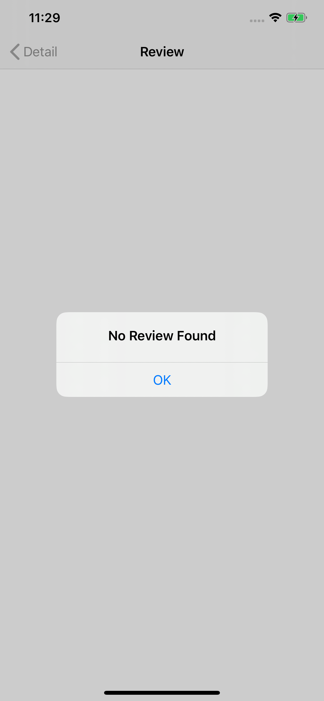
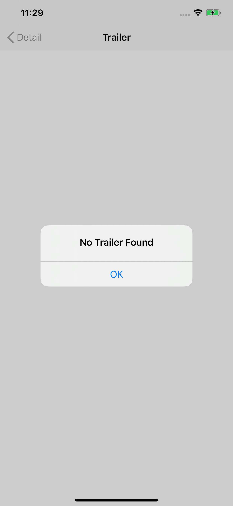

# <p align="center">TMDb iOS Application</p>

Movies app written in Swift 5 using the TMDb API, using MVVM Architechture, Clean Code (No Error No Warning)

# Screenshots
 
 
 
  
  
 

## Third-party libraries
Alamofire, AlamofireImage, RxSwift, SwiftyJSON

## Features 
- Load Genres List
- Show Movie List
- Show Movie Detail
- Show Review List
- Show Trailer List 
- Streaming Trailer
- Endless Scrolling on Movie & Review List
- Positive & Negative Case

# Installations : 
  - Clone or download this project
  - Open ```.xcworkspace``` file
  - If you need to refresh Pod file Go to project directory, then run ```pod install``` from your terminal
  
# Requirements : 
  - Xcode 11.3+
  - IOS 13.0+
  - Swift 5.0
  - Pod

# Contact 
Ask me : adiwibowoplus@gmail.com
